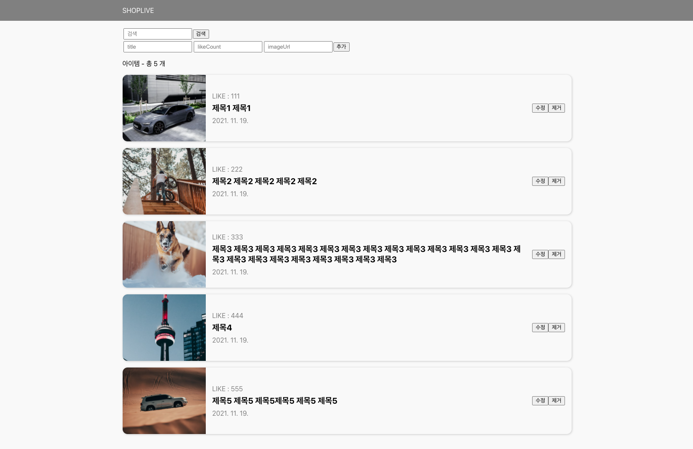
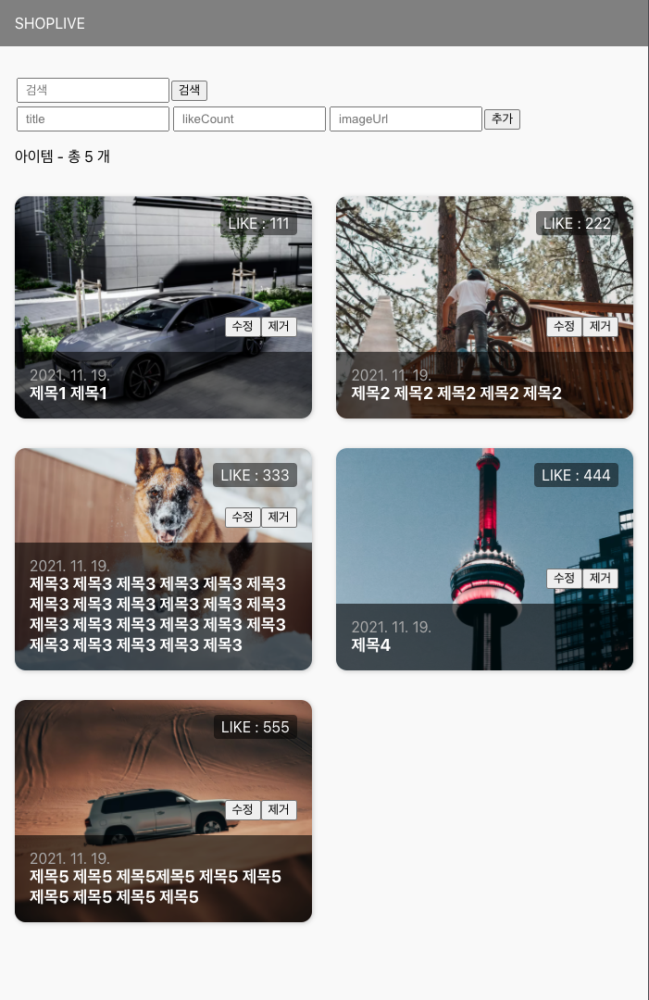
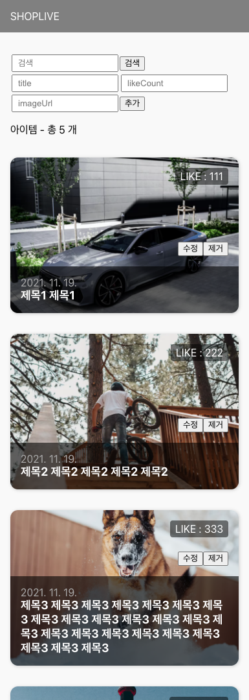

 <div align="center">

# 샵라이브 과제 - 사진첩 기능 구현📓

<b> React, JavaScript, CSS </b>

<p>
  
  
  <br/>
  
  
      
</p>

</div>

## 📒 프로젝트 개요

<details><summary>과제 설명</summary>

<h1>샵라이브 과제</h1>
  <p>모든 문제를 완벽하게 풀지 못하셔도 됩니다.
    <br/>최대한 비슷하게 구현하도록 노력하되, 할 수 있는데까지 하시면 됩니다.
    <br/>상황에 따라 다른 해결책을 제안해 주셔도 됩니다.
  </p>
  <h2>문제 1.</h2>
  <p>주어진 데이터를 이용하여, 반응형 웹을 구성하세요</p>
  <p>반응형 break point는 - <br/>1. Desktop (1025px ~) <br/>2. Tablet (480px ~ 1024px)<br/>3. Mobile ( ~ 480px)</p>
  <h3>데스크탑 (1024px ~ ) 사이즈에서는 아래 스크린샷과 같은 형태로 보이면 됩니다.</h3>



<h3>Tablet (480px ~ 1024px) 사이즈에서는 아래 스크린샷과 같은 형태로 보이면 됩니다.</h3>



<h3>Mobile (~ 480px) 사이즈에서는 아래 스크린샷과 같은 형태로 보이면 됩니다.</h3>



<h2>문제 2.</h2>
  <p>아이템 - '추가' 기능을 구현합니다.</p>
  <p>주어진 인풋에 title, likeCount, imageUrl 을 입력한 후 '추가'버튼을 클릭하면, 아이템이 추가되면 됩니다.<br/>아이템을 새로 생성할 때, "id" 와 "createdAt"은, 추가되는 시점의 TIMESTAMP 값을 자동으로 지정합니다.</p>

<h2>문제 3.</h2>
  <p> 아이템 - '제거' 기능을 구현합니다.</p>
  <p>각 아이템마다 표시되는 '제거'버튼을 클릭하면, 해당 아이템을 제거하시면 됩니다.</p>

<h2>문제 4.</h2>
  <p>데이터를 LocalStorage 에 저장하여, 항상 최신상태를 유지합니다.</p>
  <p>페이지를 새로고침하여도 데이터는 유지되야 합니다.</p>

 <h2>문제 5.</h2>
  <p>아이템 - '수정' 기능을 구현합니다.</p>
  <p>각 아이템마다 표시되는 '수정'버튼을 클릭하면, 해당 아이템을 수정할 수 있는 기능을 구현하세요.</p>
  <p>수정하는 UI/UX 는 자유롭게 구성하시면 됩니다</p>
  <p>아이템을 수정하는 중에 '취소' 와 '저장' 기능을 제공하면 좋겠습니다.</p>

<h2>문제 6.</h2>
  <p>검색기능을 구현하세요.</p>
  <p>주어진 검색 input 에 검색어를 입력하고 '검색' 버튼을 클릭하면, 제목에 해당 키워드를 포함한 아이템만 목록에 표시합니다.</p>
  <p>검색을 취소하고 전체목록을 표시하도록 돌아가는 기능도 구현해 주세요.</p>

<h2>Bonus 문제 7.</h2>
  <p>검색결과를 더 멋지게 표현해 봅시다.</p>
  <p>검색결과 화면에서 '검색어'가 입력된 부분만 스타일을 변경하여 Highlight 되도록 해봅시다.</p>

  <p>ex - '두산' 이라고 검색어를 입력했을 때,</p>
  <p>"동해물과 백<span style="background-color:yellow; color:red; fontWeight:bold;" >두산</span>이 마르고 닳도록..."</p>
</details>

## ⏳ 개발 기간

2022/09/22 ~ 2022/09/29

## 📷 프로젝트 시연

[github-page 보러가기](https://syoungee.github.io/shoplive-frontend-task-1/)

<details><summary>sample data</summary>

```text
  1)
  title:
  시간의 바깥
  서로를 닮아 기울어진 삶
  소원을 담아 차오르는 달 하려다 만
  괄호 속의 말 이제야 음 음 음

  likeCount: 6789

  imageUrl: https://velog.velcdn.com/images/syoungee/post/219b2cf0-fac7-4a42-91ef-6c468202b169/image.JPG

  2)
  title:
  너랑 나
  눈 깜박하면 어른이 될 거에요
  날 알아보겠죠 그댄 기억하겠죠
  그래 기묘했던 아이(아이)
  손 틈새로 비치는 네 모습(아!이!유!) 참 좋다

  likeCount: 29345

  imageUrl: https://velog.velcdn.com/images/syoungee/post/efed142c-9657-4e18-b538-10c21451d6dd/image.JPG

  3)
  title:
  Eight
  우리는 오렌지 태양 아래
  그림자 없이 함께 춤을 춰
  정해진 이별 따위는 없어
  아름다웠던 그 기억에서 만나 Forever young

  likeCount: 1004

  imageUrl: https://velog.velcdn.com/images/syoungee/post/1a42d86e-97c0-4298-b493-93d7bcee8f86/image.JPG

```

</details>


https://user-images.githubusercontent.com/22606199/192939778-359b9c7b-4c92-4525-9c73-fa55a3a3a2c2.mp4

https://user-images.githubusercontent.com/22606199/192939794-fa05c51b-4b0f-49d9-888c-4af215600245.mp4

https://user-images.githubusercontent.com/22606199/192940271-6a5993d4-28ef-47c0-9990-de16407249d6.MP4

## 🔑 구현 기능

<b>✔️ 7가지 기능 구현 완료</b>

- [x] 1. 반응형 웹 구성 (1025px~, 480px~1024px, ~480px)
- [x] 2. 아이템 추가 기능 구현(id와 createdAt은 TIMESTAMP값으로 자동 지정)
- [x] 3. 아이템 제거 기능 구현
- [x] 4. 아이템 데이터 LocalStorage저장(새로 고침 시 데이터 유지)
- [x] 5. 아이템 수정 기능 구현(수정 페이지 자유롭게 구현, 취소, 저장 기능 제공)
- [x] 6. 검색 기능 구현
- [x] 7. 검색 기능 구현 - Highlight 기능 추가
